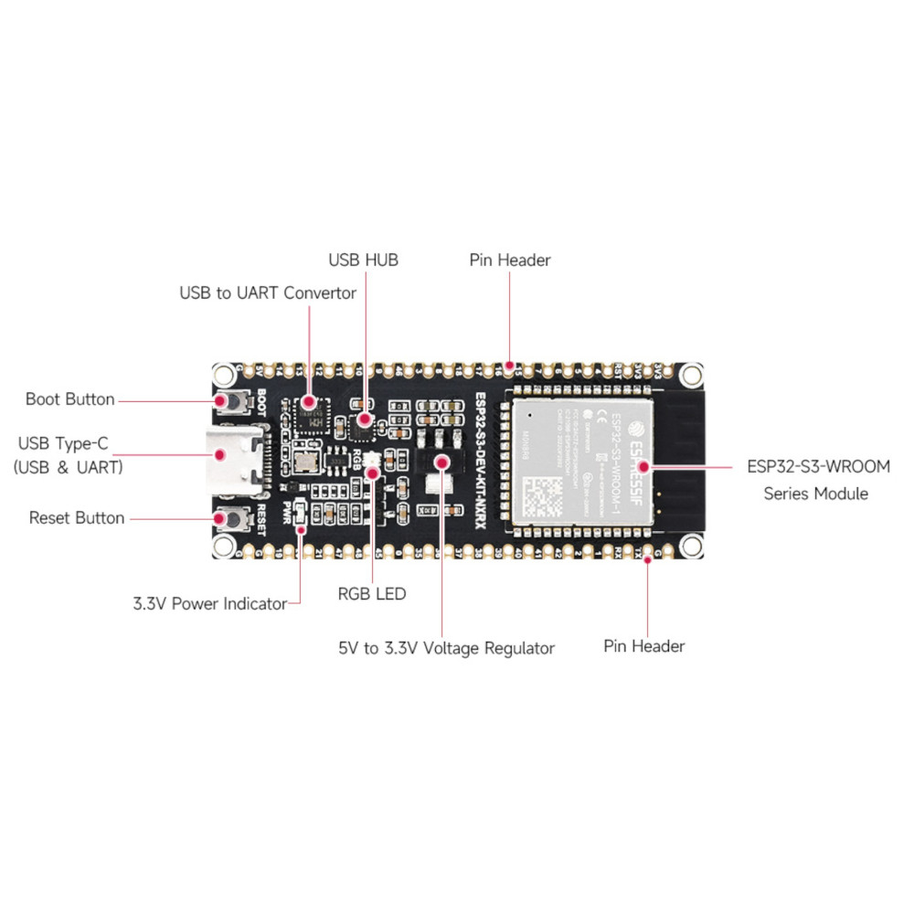
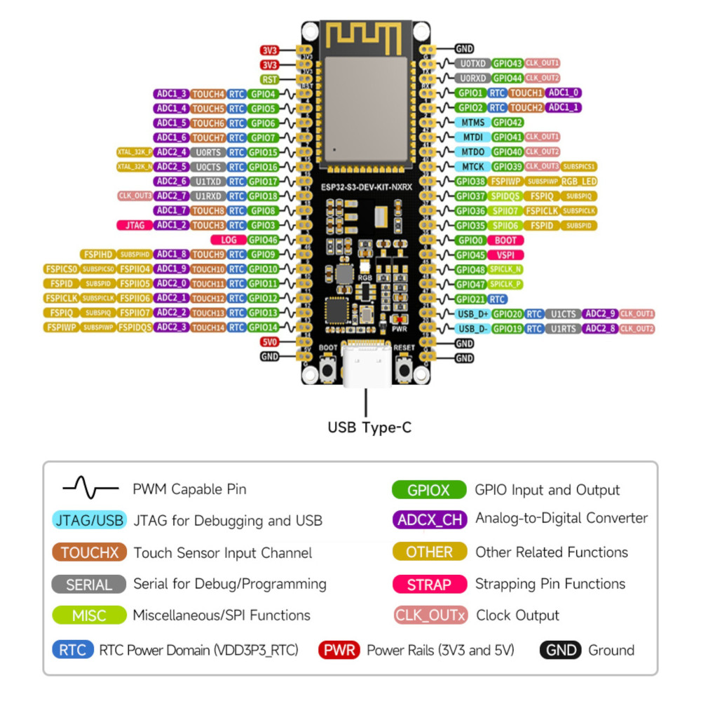

# gpio_map.md
#
# Project: singularity
# Purpose: ESP32-S3-WROOM-1 GPIO pin reference and bus assignment map.
#          This file is the single source of truth for all hardware pin
#          decisions. Every pin assignment must be recorded here before
#          it is used in any firmware or configuration file.
#
# Last updated: 2026-08-25

---

## ESP32-S3-WROOM-1 Pin Rules

### ❌ RESERVED — DO NOT USE

| GPIO Range | Reason |
|------------|--------|
| GPIO 26–32 | Internal Flash / PSRAM strapping — connected to module flash; using these will corrupt firmware |
| GPIO 19–20 | USB JTAG D− / D+ lines — required for USB debugging and flashing |
| GPIO 43–44 | UART0 TX/RX — used by the serial console / ESPHome logger |

---

### ⚠️ CAUTION — Strapping Pins

These pins control boot behaviour. They can be used as regular GPIOs **after** boot,
but must not be driven high or low by external hardware during the reset/boot sequence.

| GPIO | Boot / Strapping Function |
|------|--------------------------|
| GPIO 0  | Must be HIGH for normal boot; LOW enters download mode |
| GPIO 3  | JTAG enable strapping |
| GPIO 45 | VDD_SPI voltage select (3.3 V / 1.8 V) |
| GPIO 46 | ROM serial download mode enable |

---

### ✅ ALLOWED / SAFE — General Use

The following pins have no internal conflicts and are safe for sensors, buses,
relays, LEDs, and other peripherals:

```
GPIO 4–18, 21, 35–42, 47, 48
```

---

## Bus Assignments

### I2C Bus
Used by: ADS1115 (ADC for NTC thermistors)

| Signal | GPIO |
|--------|------|
| SDA    | GPIO 21 |
| SCL    | GPIO 47 |

### 1-Wire Bus
Used by: DS18B20 digital temperature sensor(s)

| Signal     | GPIO |
|------------|------|
| Data / DQ  | GPIO 48 |

> **Pull-up:** A 4.7 kΩ resistor between GPIO 48 and 3.3 V is required for reliable
> 1-Wire communication.

---

## Sensor Pin Map (summary)

| Sensor            | Protocol | GPIO(s)         | Notes |
|-------------------|----------|-----------------|-------|
| ADS1115           | I2C      | SDA=21, SCL=47  | Address: 0x48 (ADDR → GND) |
| NTC1-RIMS         | Analog   | ADS1115 A0      | Via ADS1115 channel 0 |
| NTC2-MASH         | Analog   | ADS1115 A1      | Via ADS1115 channel 1 |
| DS18B20 (1-Wire)  | 1-Wire   | GPIO 48         | 4.7 kΩ pull-up required |

---

## Reserved for Future Use

| GPIO | Intended Use |
|------|-------------|
| GPIO 4  | TBD — see Brewing - Sofware notes |
| GPIO 5  | TBD — see Brewing - Sofware notes |
| GPIO 6  | TBD — see Brewing - Sofware notes |
| GPIO 7  | TBD — see Brewing - Sofware notes |
| GPIO 35–40 | TBD — expansion / relay outputs |

---

## Change Log

| Date       | Author | Change |
|------------|--------|--------|
| 2026-08-25 | singularity init | Initial GPIO map created; I2C and 1-Wire buses assigned |
| 2026-08-25 | singularity | Secrets reference section added; all keys documented |
| 2026-08-25 | singularity | Verified: all secrets aligned to `singularity_` prefix convention |

---

## Secrets Configuration (Manual — Do Not Commit)

The following keys must be present in the **global `secrets.yaml`** on the
Home Assistant instance (Raspberry Pi). This file is managed manually on the
device and is **never committed to the repository**.

```yaml
# ── Wi-Fi — dirac_iot network (existing devices) ──────────────────────────────
wifi_ssid: "dirac_iot"
wifi_password: "Quantum@1922"

# ── singularity — ESP32-S3 brewing controller ─────────────────────────────────
singularity_wifi_ssid: "tesla2"
singularity_wifi_password: "qqweaasdyyxc1123"
singularity_ap_password: "qqweaasdyyxc1123"
singularity_api_encryption_key: "ZEkxifNQY8YAsUklEoVEREuHUIhxiFKW21GP0va8dd4="
singularity_ota_password: "qqweaasdyyxc1123"
```

### Key Reference

| Secret Key | Used In | Purpose |
|---|---|---|
| `wifi_ssid` | other ESP devices | SSID for the `dirac_iot` network |
| `wifi_password` | other ESP devices | Password for the `dirac_iot` network |
| `singularity_wifi_ssid` | `esp32_singularity.yaml` | SSID for the `tesla2` network |
| `singularity_wifi_password` | `esp32_singularity.yaml` | Password for the `tesla2` network |
| `singularity_ap_password` | `esp32_singularity.yaml` | Fallback AP hotspot password |
| `singularity_api_encryption_key` | `esp32_singularity.yaml` | Native API encryption (HA ↔ ESP32) |
| `singularity_ota_password` | `esp32_singularity.yaml` | OTA firmware update password |

### Rules

- All singularity secrets use the `singularity_` prefix to avoid collision with other devices.
- `wifi_ssid` / `wifi_password` belong to `dirac_iot` — never reference them in singularity configs.
- The `secrets.yaml` file must **never** be committed to Git. Add it to `.gitignore` if not already present.
- The `singularity_api_encryption_key` was generated on 2026-08-25. If regenerated, reflash the device — the key is baked into the firmware.

---

## Hardware Reference — ESP32-S3-DEV-KIT-NXRX

### Board Overview



| Component | Description |
|---|---|
| Module | ESP32-S3-WROOM series |
| USB | USB Type-C (USB & UART combined) |
| USB to UART | Built-in converter for serial flashing |
| USB HUB | On-board USB hub |
| Boot Button | Hold during reset to enter download mode |
| Reset Button | Resets the MCU |
| RGB LED | Connected to GPIO 38 (WS2812) |
| 3.3V Regulator | 5V → 3.3V on-board |
| 3.3V Indicator | PWR LED confirms 3.3V rail is live |

---

### Full Pinout Diagram



### Pin Legend

| Colour | Function |
|---|---|
| Purple | ADC (Analog-to-Digital Converter) |
| Cyan | JTAG / USB |
| Orange | Touch sensor input |
| Grey | Serial (debug/programming) |
| Yellow-green | Miscellaneous / SPI |
| Blue | RTC power domain |
| Green | GPIO input/output |
| Yellow | Other related functions |
| Pink | Strapping pins |
| Red | CLK output |
| Red (PWR) | Power rails (3.3V and 5V) |
| Black | Ground |

### singularity Pin Assignments Cross-Reference

| GPIO | Board label | Our use | Safe? |
|---|---|---|---|
| GPIO 21 | RTC | I2C SDA | ✅ |
| GPIO 47 | SPICLK_P | I2C SCL | ✅ |
| GPIO 48 | SPICLK_N | 1-Wire DS18B20 | ✅ |
| GPIO 43 | U0TXD | RESERVED — UART0 TX | ❌ |
| GPIO 44 | U0RXD | RESERVED — UART0 RX | ❌ |
| GPIO 19 | USB_D− | RESERVED — USB | ❌ |
| GPIO 20 | USB_D+ | RESERVED — USB | ❌ |
| GPIO 46 | LOG | CAUTION — strapping | ⚠️ |
| GPIO 0 | BOOT | CAUTION — strapping | ⚠️ |
| GPIO 45 | VSPI | CAUTION — strapping | ⚠️ |
| GPIO 38 | RGB LED | On-board RGB LED | ℹ️ avoid if not using LED |
