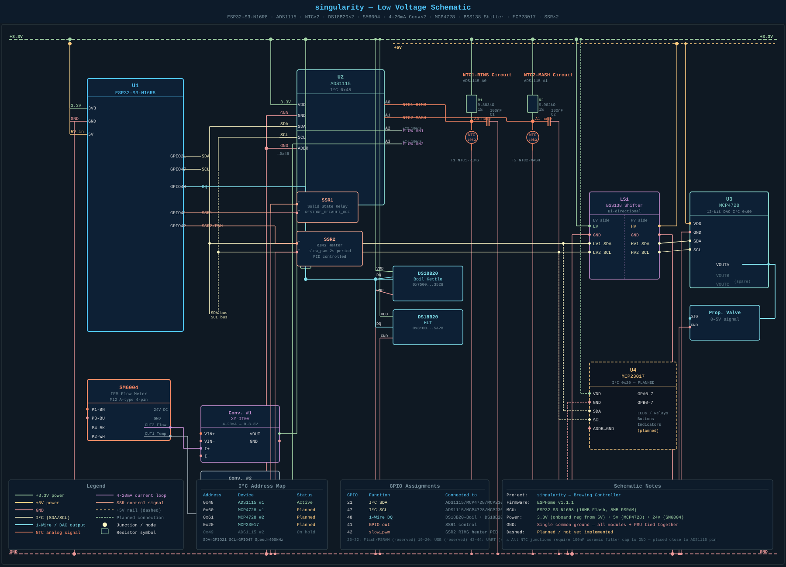

# singularity — Low Voltage Schematic

This page is the main electrical reference for the singularity brewing controller. It covers all low-voltage connections: the ESP32-S3 microcontroller and every sensor and I/O module.

> 📐 **Full schematic SVG** (open for zoom/pan):
> [assets/schematics/singularity_schematic.svg](../assets/schematics/singularity_schematic.svg)

---

## Schematic

---

## What is shown

| Block | Component | Status |
|---|---|---|
| U1 | ESP32-S3-N16R8 — MCU | ✅ Active |
| U2 | ADS1115 #1 (0x48) — 16-bit ADC | ✅ Active |
| R1/T1 | NTC1-RIMS voltage divider circuit | ✅ Active |
| R2/T2 | NTC2-MASH voltage divider circuit | ✅ Active |
| DS18B20-Boil | 1-Wire temperature sensor — boil kettle | ✅ Active |
| DS18B20-HLT | 1-Wire temperature sensor — HLT | ✅ Active |
| SM6004 | IFM flow meter — M12 4-pin connector | 🔬 Testing |
| Conv. #1 | XY-IT0V 4-20mA → 0-3.3V (flow, ADS1115 A2) | 🔬 Testing |
| Conv. #2 | XY-IT0V 4-20mA → 0-3.3V (temp, ADS1115 A3) | 🔲 Planned |
| LS1 | BSS138 bi-directional I2C level shifter | 🔲 Planned |
| U3 | MCP4728 12-bit DAC (0x60) — proportional valve | 🔲 Planned |
| Prop. Valve | Proportional valve — 0–5V control | 🔲 Planned |
| U4 | MCP23017 16-bit GPIO expander (0x20) | 🔲 Planned |
| SSR1 | Solid state relay — spare output GPIO41 | ✅ Wired |
| SSR2 | Solid state relay — RIMS heater GPIO42 PID | ✅ Wired |

---

## Power Rails

| Rail | Voltage | Used by |
|---|---|---|
| +3.3V | 3.3V (from ESP32 onboard reg) | ESP32, ADS1115, DS18B20, NTC dividers, pull-ups, MCP23017 |
| +5V | 5V (from DC-DC step-down) | ESP32 input, MCP4728 VDD, level shifter HV side |
| +24V | 24V (main PSU) | SM6004, 4-20mA converter modules VIN+ |
| GND | 0V | All modules — single common ground required |

---

## GPIO Assignments

| GPIO | Direction | Function | Connected to |
|---|---|---|---|
| 21 | Bidirectional | I²C SDA | ADS1115, MCP4728 (via shifter), MCP23017 |
| 47 | Bidirectional | I²C SCL | ADS1115, MCP4728 (via shifter), MCP23017 |
| 48 | Bidirectional | 1-Wire DQ | DS18B20-Boil, DS18B20-HLT (parallel, 4.7kΩ pull-up) |
| 41 | Output | SSR1 control | SSR1 control input |
| 42 | Output (slow_pwm) | RIMS heater PID | SSR2 control input (2s period) |

Reserved — do not use:
- **GPIO 26–32** — internal Flash/PSRAM
- **GPIO 19–20** — USB D−/D+
- **GPIO 43–44** — UART0 TX/RX (logger)
- **GPIO 0, 3, 45, 46** — strapping pins

---

## I²C Address Map

| Address | Device | Status |
|---|---|---|
| 0x48 | ADS1115 #1 (ADDR → GND) | ✅ Active |
| 0x60 | MCP4728 #1 (default) | 🔲 Planned |
| 0x61 | MCP4728 #2 (reprogrammed via Arduino) | 🔲 Planned |
| 0x20 | MCP23017 #1 (A0/A1/A2 → GND) | 🔲 Planned |
| 0x49 | ADS1115 #2 | ⏸ On hold — floating input issue |

**Bus:** SDA = GPIO21 · SCL = GPIO47 · Speed = 400kHz

---

## Key Design Notes

**NTC filter capacitors:** Every ADS1115 analog input (A0–A3) requires a 100nF ceramic capacitor between the input pin and GND, placed as close to the ADS1115 pin as possible. This filters HF noise from SSRs, pump motors and mains wiring.

**I²C pull-ups:** Most breakout modules include onboard pull-ups. Do not stack multiple pull-ups — remove pull-ups from all but one module to avoid the effective resistance dropping too low.

**MCP4728 level shifter:** The MCP4728 runs on 5V to achieve 0–5V output for the proportional valve. Its I²C lines must go through a BSS138 bi-directional level shifter. The ADS1115 and MCP23017 connect directly on the 3.3V side — they must not connect to the 5V side of the shifter.

**Common ground:** All GNDs (ESP32, ADS1115, DS18B20, 4-20mA converters, 24V PSU, MCP4728, MCP23017) must share a single common ground. Without this the 4-20mA current loop has no return path and readings will be incorrect.

**DS18B20 pull-up:** A single 4.7kΩ pull-up on GPIO48 serves both DS18B20 sensors. Do not add a second pull-up — one per bus only.

---

## Related Pages

- [hardware/gpio_map.md](gpio_map.md) — full GPIO rules and bus assignments
- [hardware/ntc.md](ntc.md) — NTC Steinhart-Hart calibration
- [hardware/ds18b20.md](ds18b20.md) — DS18B20 1-Wire wiring
- [hardware/expansion_boards.md](expansion_boards.md) — ADS1115, MCP4728, MCP23017
- [hardware/sm6004.md](sm6004.md) — SM6004 flow meter
- [hardware/current_to_voltage.md](current_to_voltage.md) — 4-20mA converter module
- [assets/schematics/mcp4728_proportional_valve.svg](../assets/schematics/mcp4728_proportional_valve.svg) — detail schematic: MCP4728 + level shifter + valve
