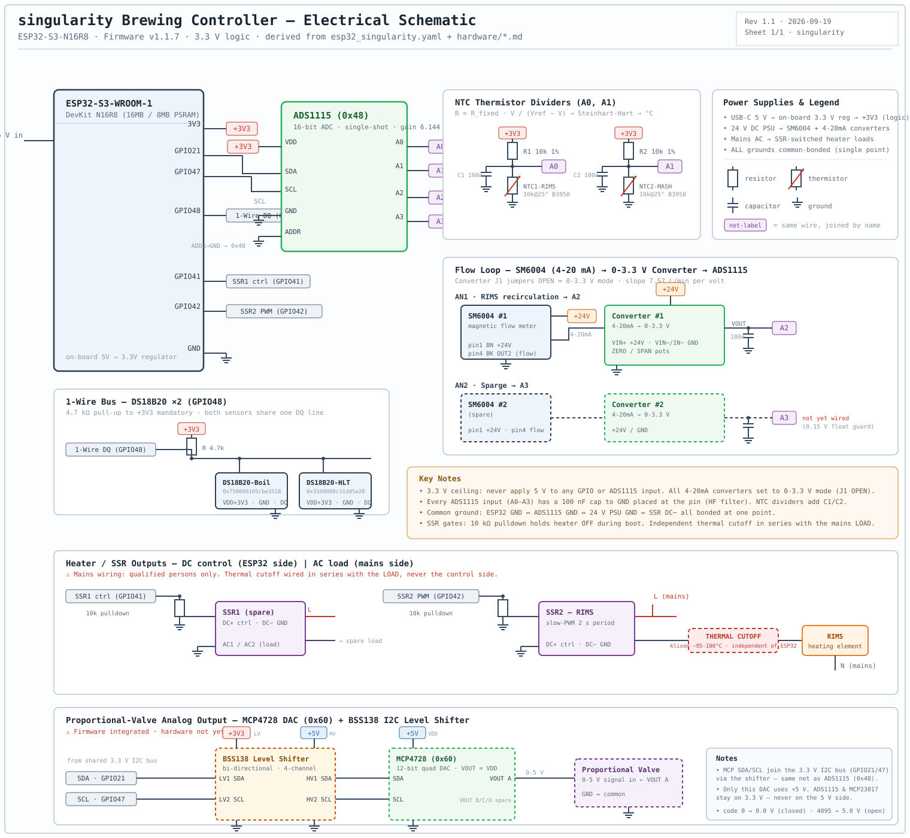

# Electrical Schematic

**Project:** singularity | **Firmware:** v1.2.0 | **Last updated:** 2026-09-09

Single-sheet electrical schematic for the singularity brewing controller, derived
from [`esp32_singularity.yaml`](../esp32_singularity.yaml) and the hardware docs.



> Open [`schematic.svg`](schematic.svg) directly for a full-resolution, zoomable view.

---

## What it covers

| Block | Detail | Source |
|---|---|---|
| **ESP32-S3-WROOM-1** | GPIO21 SDA · GPIO47 SCL · GPIO48 1-Wire · GPIO41/42 SSR · 3V3 / GND | [gpio_map.md](../hardware/gpio_map.md) |
| **ADS1115 (0x48)** | I2C, ADDR→GND, A0–A3, 100 nF per input | [gpio_map.md](../hardware/gpio_map.md) |
| **NTC dividers** | 10 kΩ 1% + NTC (10k@25° B3950) + 100 nF → A0 / A1 | [ntc.md](../hardware/ntc.md) |
| **Flow loop** | SM6004 → 4-20mA→0-3.3V converter → A2 (RIMS) / A3 (Sparge, spare) | [sm6004.md](../hardware/sm6004.md), [current_to_voltage.md](../hardware/current_to_voltage.md) |
| **1-Wire** | 2× DS18B20 (Boil, HLT) on GPIO48, 4.7 kΩ pull-up | [ds18b20.md](../hardware/ds18b20.md) |
| **SSR outputs** | GPIO41/42 → 10 kΩ boot pulldown → SSR; independent thermal cutoff in series with mains load | [gpio_map.md](../hardware/gpio_map.md) |

## Convention notes

- **Net labels** (e.g. `A0`, `+3V3`) join nets by name instead of drawing every long wire — standard schematic practice for readability.
- **3.3 V ceiling** — never apply 5 V to any GPIO or ADS1115 input; converters set to 0-3.3 V (J1 OPEN).
- **A2/A3** follow the firmware YAML: A2 = AN1 RIMS flow, A3 = AN2 Sparge flow (not yet wired). This supersedes the earlier temperature-output mapping noted in `current_to_voltage.md`.
- The **thermal cutoff** (klixon) is drawn dashed/red because it is a required hardware guard *independent of the ESP32*, wired in series with the mains **load** — see the warning in [gpio_map.md](../hardware/gpio_map.md#ssr-gate-circuit-gpio-41--42--pulldown-required).

## Regenerating / editing

`schematic.svg` is hand-authored vector XML — edit it directly in any editor.
To export a PNG on macOS:

```sh
qlmanage -t -s 1600 -o . schematics/schematic.svg   # → schematic.svg.png
```
